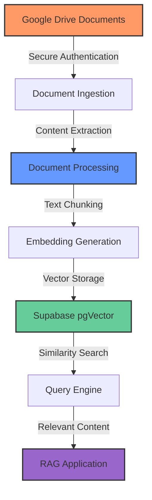

# Enterprise-Grade RAG with Google Drive & Supabase

[](https://youtu.be/auxO_NYTexc "Watch the Tutorial")

A production-ready Retrieval-Augmented Generation (RAG) system featuring Google Drive integration, document versioning, and Supabase vector storage. This enterprise-grade RAG solution provides advanced document processing capabilities at a fraction of the cost of commercial API services.

## ⚠️ Important Disclaimer

**This framework is intended as a demonstration and educational resource.** Retrieval-Augmented Generation (RAG) is not a one-size-fits-all solution, and the implementation needs to be tailored to your specific use case for optimal results.

To use this framework effectively with your own data:
- You will need to modify components to match your specific document types and content structure
- Chunking strategies should be adjusted based on your query patterns and document characteristics
- Embedding models may need to be changed depending on your domain-specific terminology
- Performance tuning will be required based on your scale and response time requirements

While this framework provides a solid foundation, successful RAG implementations require iterative testing and optimization with your actual data and use cases.

## 🚀 Why Use This RAG System?

- **Enterprise-Ready**: Production-quality implementation with robust error handling, versioning, and comprehensive metadata
- **Cost-Effective**: Build your own RAG system without expensive API or SaaS subscription costs
- **Full Control**: Customize every aspect of your RAG pipeline to your exact requirements
- **Complete Privacy**: Your documents never leave your infrastructure - essential for sensitive data
- **Advanced Features**: Document versioning, image OCR, table extraction, and face detection capabilities
- **Seamless Integration**: Works natively with Google Drive and Supabase for simple deployment

## ⚡ System Workflow



## Core Features

- **Google Drive Integration**: Secure document access with service account authentication
- **Advanced Document Versioning**: 
  - Track document changes with automatic version history
  - Skip unchanged documents to reduce processing & embedding costs
  - Distinguish between content changes vs. metadata-only updates
- **Rich Metadata Extraction**:
  - Comprehensive document metadata including access permissions
  - Direct permissions API with SSL error handling
  - Hierarchical metadata with role-based access summaries
- **Advanced Media Processing**:
  - OCR for text extraction from images
  - Table extraction from PDFs with structure preservation
  - Image analysis with face detection and visual content understanding
- **High-Performance Processing**:
  - Parallel document processing with built-in timeout protection
  - Optimized chunking with content-aware boundary detection
  - Efficient error handling with graceful degradation
- **Enterprise Vector Storage**:
  - Supabase pgvector with optimized indexes
  - Document-level versioning and change tracking
  - Metadata-rich embeddings for advanced filtering

## 📊 Cost Comparison

Building your own RAG system with this solution can be significantly more cost-effective than using commercial services:

| Component | Cost Factor | Monthly Est. (10k docs) | Notes |
|-----------|-------------|-------------------------|-------|
| **Supabase** | Vector storage | $0-25/month | Free tier available for smaller collections |
| **OpenAI API** | Embeddings | $0.50-5/month | Based on ~$0.0001/1K tokens |
| **Google Drive** | Document storage | $0-2/month | Free tier available (15GB) |
| **Total** | | **$0.50-32/month** | |

**Compared to Commercial RAG Services:**
- Enterprise RAG solutions: $500-5,000/month (based on usage)
- Managed vector DBs: $50-500/month (for similar document volume)
- Commercial embedding APIs: $20-200/month (for similar document volume)

## Architecture

The system follows a modular design with these key components:

```mermaid
flowchart LR
    GDrive["Google Drive Documents"] --> Auth["Authentication (auth.py)"]
    Auth --> Ingestion["Document Ingestion (ingestion.py)"]
    Ingestion --> Processor["Document Processor (utils.py)"]
    Processor --> VectorStore["Supabase pgVector (store.py)"]
    VectorStore --> Query["Query Engine (query.py)"]
    Query --> Results["Search Results"]
    
    classDef core fill:#0d5794,stroke:#333,stroke-width:1px;
    classDef data fill:#b3a41d,stroke:#333,stroke-width:1px;
    classDef process fill:#a934e3,stroke:#333,stroke-width:1px;
    
    class GDrive,Results data;
    class Auth,Ingestion,Processor,VectorStore,Query core;
```



See the full [Architecture Documentation](docs/architecture.md) for more details on the system design.

## Requirements

- Python 3.9 or higher
- Supabase account (for vector storage)
- OpenAI API key
- Google Drive access (service account recommended)

## Installation

### Linux/macOS

```bash
# Clone the repository
git clone https://github.com/Getting-Automated/n8n-rag-example.git
cd n8n-rag-example

# Run the setup script
chmod +x setup.sh
./setup.sh
```

### Windows

```batch
# Clone the repository
git clone https://github.com/Getting-Automated/n8n-rag-example.git
cd n8n-rag-example

# Run the setup script
setup.bat
```

## Quick Start

Check out the [Quick Start Guide](docs/quickstart.md) for setup instructions and examples.

## Documentation

Full documentation is available in the [docs](docs/) directory:

- [Quick Start Guide](docs/quickstart.md)
- [Architecture Overview](docs/architecture.md)
- [Advanced Usage](docs/advanced_usage.md)
- [Supabase Setup Guide](docs/supabase_setup.md)
- [Troubleshooting](docs/troubleshooting.md)

## Examples

The repository includes comprehensive examples in the `examples/` directory:

```bash
# Activate your virtual environment
source venv/bin/activate  # Linux/macOS
venv\Scripts\activate     # Windows

# Run the examples
python examples/langchain_examples.py
```

The examples demonstrate:
1. Basic ingestion with standard settings
2. Advanced ingestion with enhanced features
3. Specific file processing with precision targeting
4. Enhanced media processing for images and PDFs

## Project Structure

```
n8n-rag-example/
├── config/                      # Configuration files
│   └── service-account.json     # Google service account credentials (add your own)
├── docs/                        # Documentation
│   ├── advanced_usage.md        # Advanced usage guide
│   ├── architecture.md          # Architecture documentation
│   ├── quickstart.md            # Quick start guide
│   ├── supabase_setup.md        # Supabase setup instructions
│   └── troubleshooting.md       # Troubleshooting guide
├── examples/                    # Example code
│   └── langchain_examples.py    # Comprehensive usage examples
├── rag/                         # Core RAG module
│   ├── __init__.py              # Package initialization
│   ├── auth.py                  # Authentication utilities
│   ├── ingestion.py             # Document ingestion logic
│   ├── query.py                 # Query processing
│   ├── store.py                 # Vector store management
│   └── utils.py                 # Helper utilities
├── utils/                       # Utility modules
│   ├── __init__.py              # Package initialization
│   └── display_utils.py         # Display utilities for examples
├── setup_vector_store.sql       # SQL setup for Supabase
├── setup.sh                     # Setup script for Linux/macOS
├── setup.bat                    # Setup script for Windows
├── requirements.txt             # Python dependencies
└── ARCHITECTURE.md              # High-level architecture overview
```

## 🤝 Join the Getting Automated Community

Want to go deeper with automation and get direct support? Join our exclusive automation community!

### What You Get from the Getting Automated Community:
- **In-depth Automation Workflows**: Learn how to integrate AI into your automation processes
- **Battle-Tested Templates**: Access exclusive, production-ready automation templates
- **Expert Guidance**: Get direct support from automation professionals
- **Early Access to Content**: Be the first to access exclusive content
- **Private Support Channels**: Receive personalized support through direct chat and office hours
- **Community of Serious Builders**: Connect with like-minded professionals

The community is capped at 250 members to ensure quality support and interaction.

[Join the Getting Automated Community](https://resources.gettingautomated.com/)

## 🔗 Additional Resources

- **Website**: [Getting Automated](https://gettingautomated.com)
- **YouTube Channel**: [Getting Automated YouTube](https://www.youtube.com/@hunterasneed)
- **Free Workflow Automation Tools**: [Automation Tools](https://tools.gettingautomated.com)

### Need Personalized Help?

If you need this solution built for you or want personalized guidance, you can schedule a consultation:

[Schedule a 30-Minute Connect](https://calendly.com/workflowsy/30-minute-connect)

## 📄 License

MIT