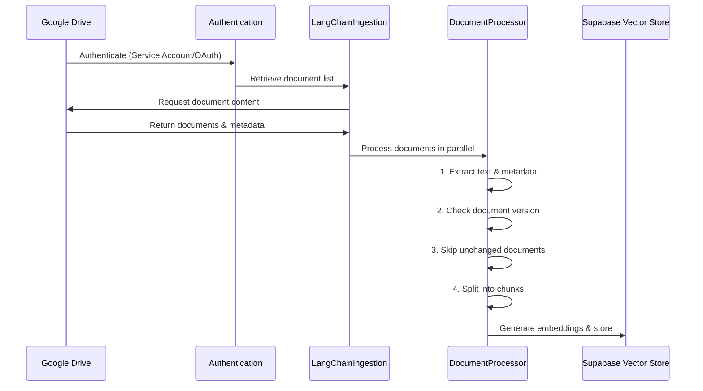
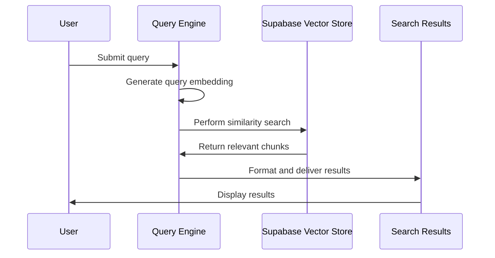
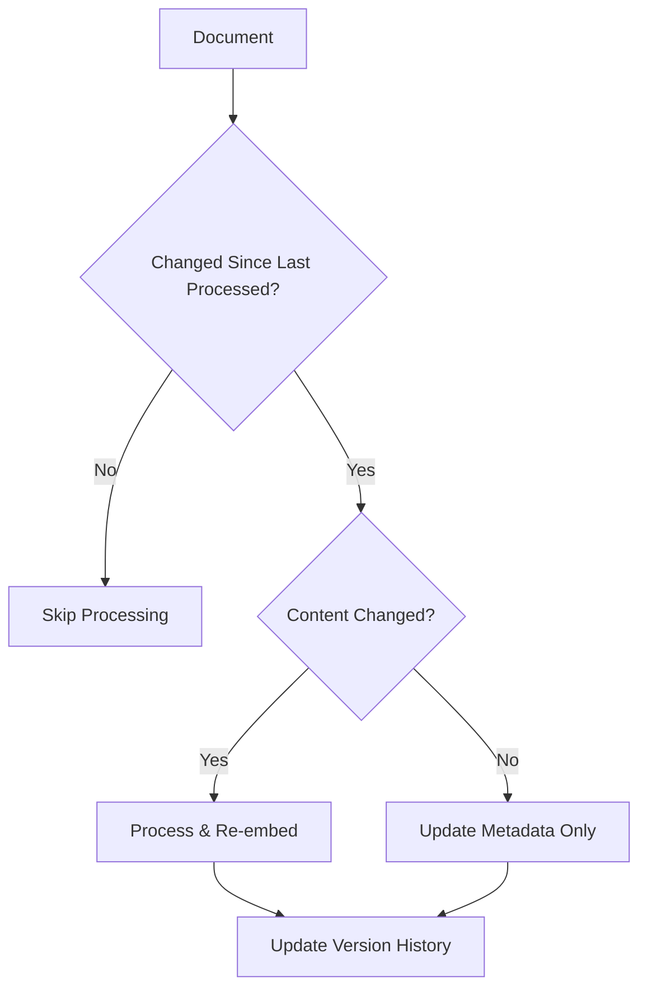
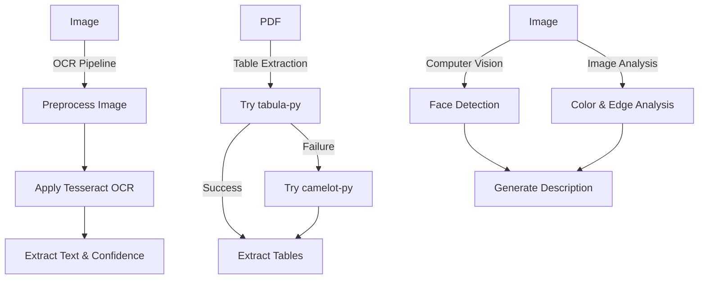
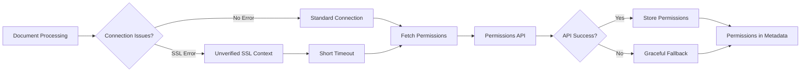
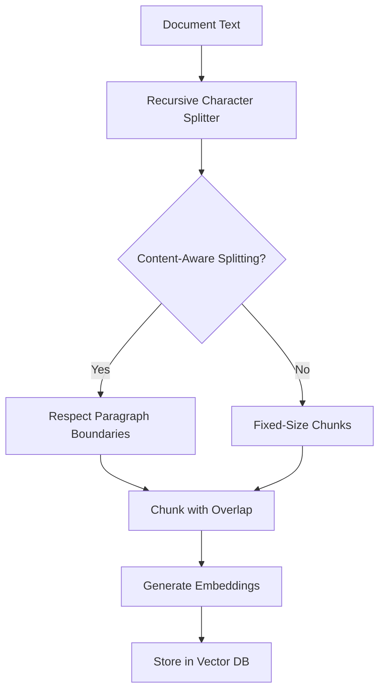

# Architecture Overview

This document provides a detailed explanation of the n8n RAG Example architecture, including components, data flow, and design principles.

## System Architecture


## Core Components

### 1. Authentication Module (`rag/auth.py`)

The authentication module handles Google Drive authentication:

- Supports service account authentication (recommended for backend use)
- Supports OAuth2 authentication for accessing personal user content
- Manages token refresh and credential handling

### 2. Document Ingestion (`rag/ingestion.py`)

The ingestion module is responsible for retrieving and processing documents:

- Retrieves documents from Google Drive
- Extracts text content and metadata
- Implements document versioning and change tracking
- Handles parallel processing with timeout protection
- Provides direct permissions API with robust SSL error handling

### 3. Document Processing (`rag/utils.py`)

The utilities module provides document processing functionality:

- Advanced text extraction from various document types
- Content-aware chunking with boundary preservation
- OCR for image text extraction
- Table extraction from PDFs
- Image analysis with computer vision techniques

### 4. Vector Storage (`rag/store.py`)

The store module manages vector database operations:

- Handles connections to Supabase pgvector
- Provides efficient embedding storage and retrieval
- Supports metadata-rich vector storage
- Implements optimized vector indexes for search

### 5. Query Engine (`rag/query.py`)

The query engine provides retrieval capabilities:

- Performs vector similarity search
- Supports metadata filtering
- Retrieves relevant document chunks based on queries
- Formats results for consumption

## Data Flow

### Ingestion Flow



### Query Flow



## Key Features

### Document Versioning

The system tracks document versions to optimize processing and storage:



### Advanced Media Processing

The system includes multi-modal processing capabilities:



### Permissions Handling

Robust permissions handling for Google Drive documents:



### Content-Aware Chunking

Advanced chunking strategies for optimal document splitting:



## Database Schema

### Supabase pgvector Schema

```sql
-- Main documents table
CREATE TABLE langchain_docs (
  id TEXT PRIMARY KEY,
  content TEXT,
  metadata JSONB,
  embedding VECTOR(1536)
);

-- Example table for testing
CREATE TABLE langchain_example (
  id TEXT PRIMARY KEY,
  content TEXT,
  metadata JSONB,
  embedding VECTOR(1536)
);

-- Indexes for efficient vector search
CREATE INDEX ON langchain_docs USING ivfflat (embedding vector_cosine_ops) WITH (lists = 100);
CREATE INDEX IF NOT EXISTS hnsw_index ON langchain_docs USING hnsw (embedding vector_cosine_ops);
```

## Design Principles

### 1. Modularity

The system is designed with modularity in mind:
- Clear separation of concerns between components
- Well-defined interfaces between modules
- Pluggable components that can be extended or replaced

### 2. Performance Optimization

Key performance features include:
- Parallel document processing
- Optimized vector search with specialized indexes
- Skip processing for unchanged documents
- Timeout protection for problematic files

### 3. Reliability

The system prioritizes reliability:
- Robust error handling
- Graceful degradation when subsystems fail
- Comprehensive logging
- SSL error recovery

### 4. Rich Metadata

The system captures and utilizes rich metadata:
- Document-level versioning
- Comprehensive permission information
- Detailed content analysis
- Source tracking and provenance

## Project Structure

```
n8n-rag-example/
├── config/                      # Configuration files
│   └── service-account.json     # Google service account credentials
├── docs/                        # Documentation
│   ├── advanced_usage.md        # Advanced usage guide
│   ├── architecture.md          # Architecture documentation
│   ├── quickstart.md            # Quick start guide
│   ├── supabase_setup.md        # Supabase setup instructions
│   └── troubleshooting.md       # Troubleshooting guide
├── examples/                    # Example code
│   └── langchain_examples.py    # Comprehensive usage examples
├── rag/                         # Core RAG module
│   ├── __init__.py              # Package initialization
│   ├── auth.py                  # Authentication utilities
│   ├── ingestion.py             # Document ingestion logic
│   ├── query.py                 # Query processing
│   ├── store.py                 # Vector store management
│   └── utils.py                 # Helper utilities
├── utils/                       # Utility modules
│   └── display_utils.py         # Display utilities for examples
├── setup_vector_store.sql       # SQL setup for Supabase
├── setup.sh                     # Setup script for Linux/macOS
├── setup.bat                    # Setup script for Windows
└── requirements.txt             # Python dependencies
``` 